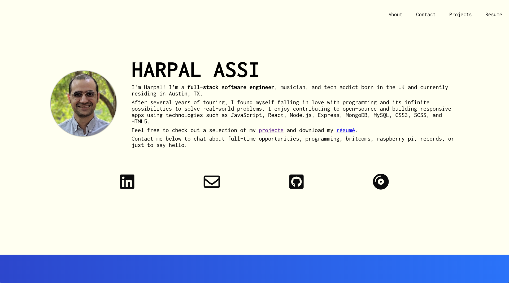

# Personal Portfolio ⚡

[](https://circleci.com/gh/harpalassi/personal-portfolio)
[](https://app.netlify.com/sites/harpalassi/deploys)

## Description

My current portfolio that I built with React and CSS3 which incorporates `a11y` and showcases projects I've worked on myself and with other developers.



🚀 Deployed at: https://www.harpalassi.com

## Getting Started

The following instructions will get you a copy of the project up and running on your local machine for development and testing purposes.

### Installation with Docker

- Using local settings

```javascript
docker-compose -f local.yml build
docker-compose -f local.yml up
```

- Using production settings

```javascript
docker-compose -f production.yml build
docker-compose -f production.yml up
```


## Tests 

Run tests by using `yarn test` in the root folder. These specs use Jest and React Testing Library and are also set up to run via CircleCI when deploying. 

## Motivation

I wanted to build a portfolio that was minimal, responsive, and accessible, yet showcase my abilities to the fullest extent. One of the biggest challenges was creating a design from scratch.

## Tools

I chose to use React for the front-end, so I could re-use UI components as well as wanting to take an overall deeper dive into the library. I incorporated lazy-loading components with `Suspense` and `React.lazy()`. I also utilized functional components with hooks over class-based components.

## Built With

- React
- CSS3
- Node.js
- Jest
- Docker
- CircleCI
